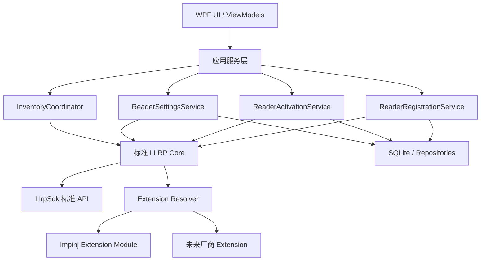
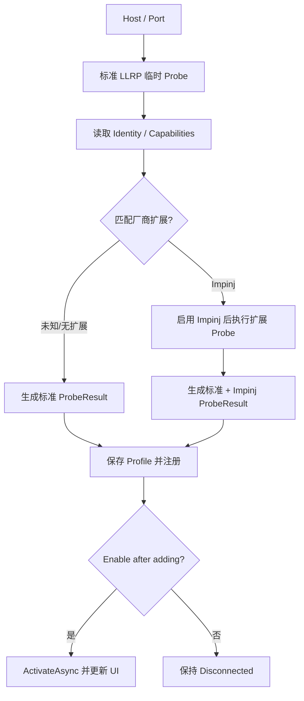

# LLRP Reader Studio 标准 LLRP 与多厂商扩展重构规划

## 0. 文档信息

- 状态：规划稿
- 基线：当前 Impinj DataSource 添加、启动检查和 Enable 重试修复
- 目标：在保留 Impinj 完整能力的基础上，支持符合 LLRP 1.0.1/1.1 的标准 Reader，并为其他厂商扩展预留稳定接口
- 实施方式：增量重构，不推倒重写 WPF 应用

## 1. 背景与结论

当前软件的底层 `LlrpSdk` 具备标准 LLRP 连接、身份与能力查询、Inventory、Tag Access、GPI/GPO 等能力，但应用层仍以 Impinj Reader 为唯一设备类型：

- `ReaderProfile.EnableImpinjExtensions` 默认开启；
- `LlrpReaderSessionFactory` 默认调用 `UseImpinj()`；
- `DataSourceSettingsViewModel` 直接引用并构造 Impinj 设置类型；
- Preset 序列化固定注册 `ImpinjReaderExtension`；
- Tag 聚合直接读取 Impinj Serialized TID；
- mDNS 发现只查询 `_llrp._tcp.local.`，无法代表所有标准 LLRP 设备。

因此，通用化不是只修改 Add Data Source 页面，而是需要重构以下三条主线：

1. Reader 注册、激活、停用和盘存的生命周期；
2. 标准 LLRP 设置与厂商扩展的边界；
3. 根据设备身份、能力、型号和固件动态组合 UI。

WPF、MVVM、DI、SQLite、Inventory、Tag Memory 和现有 Impinj 功能可以继续复用。

## 2. 支持范围分级

“支持所有 LLRP 设备”应按能力等级定义，不能承诺所有厂商的全部私有功能都可用。

| 等级 | 支持内容 | 未知厂商最低目标 |
|---|---|---|
| L1 | TCP、LLRP 握手、协议版本、身份、标准能力查询 | 必须支持 |
| L2 | 标准 Inventory、EPC、RSSI、天线、信道、SeenCount | 必须支持 |
| L3 | 标准设置、Gen2 Filter、Tag Access、GPI/GPO | 按设备能力支持 |
| L4 | Impinj Search Mode、FastID、Phase、Doppler 等厂商扩展 | 仅加载对应扩展时支持 |

首个通用版本的交付目标为：

- 未知标准 Reader：完成 L1、L2，并尽量完成 L3；
- Impinj R700/Speedway：保持现有 L1～L4 功能不回退；
- 其他厂商私有扩展：仅预留接口，不在首版实现。

## 3. 已完成的 Impinj 基线

当前 DataSource 修复可作为 P1 基线：

- 添加设备先使用临时 `ProbeAsync`，成功后才保存和注册；
- Probe Session 在验证后断开并释放；
- 软件启动对 `Enable=true` 的设备执行连接检查；
- 启动连接失败时自动设置 `Enable=false`；
- 用户手动重新打开 Enable 时重新连接验证；
- 选择设备不再隐式连接。

该基线仍有以下缺口：

- Probe 仍使用默认 Impinj Profile；
- `ReaderProbeResult` 只有 Model、Firmware；
- 启动只连接，没有统一查询当前设置并生成 UI Snapshot；
- Enable 持久化和连接操作尚未形成单一事务式流程；
- MainViewModel 仍承担过多业务职责；
- 设置页、Preset、Tag 聚合仍直接依赖 Impinj。

## 4. 核心设计决策

### 4.1 标准 LLRP 为基础，厂商功能为扩展

标准 `LlrpSdk` API 是应用的基础能力：

- `LlrpReaderBuilder`；
- `ReaderIdentity`；
- `ReaderCapabilities`；
- `ReaderSettings`；
- `InventorySettings`；
- `InventorySession`；
- 标准 Tag Access 和 GPI/GPO。

`LlrpSdk.Extensions.Impinj` 作为可选模块，通过 `UseImpinj()` 和 SDK extension contributor API 提供厂商能力。

Core 不应再直接依赖 Impinj 类型；Impinj 类型只能存在于 Impinj 扩展模块中。

### 4.2 Enable 的产品语义

根据当前需求，定义：

> `Enable=true` 表示应用应自动激活该 Reader，并保持可用于设置查询和盘存的 LLRP Session；`Enable=false` 表示断开且不参与操作。

具体规则：

- 软件启动：自动激活所有启用设备；
- 激活成功：读取身份、能力和当前设置，更新 UI；
- 激活失败：自动设置并持久化 `Enable=false`；
- 用户打开 Enable：重新执行激活；
- 用户关闭 Enable：停止该设备上的活动操作并断开；
- 软件关闭：停止所有 Inventory，断开并释放所有 Session。

### 4.3 用户意图与运行状态分离

`IsEnabled` 不能代替连接状态。建议至少分为：

```text
IsEnabled
  用户意图，持久化

ConnectionState
  Disconnected
  Connecting
  Connected
  Disconnecting
  Faulted

OperationState
  Idle
  Configuring
  Inventorying
  Accessing
```

Reader 运行快照还应包含：

```text
Identity
Capabilities
CurrentSettings
ActiveExtensions
LastCheckedAt
LastError
```

## 5. 目标总体架构



### 5.1 应用服务职责

| 服务 | 职责 |
|---|---|
| `ReaderRegistrationService` | Probe、厂商识别、添加、删除、保存和失败回滚 |
| `ReaderActivationService` | 启动恢复、Enable/Disable、连接、失败禁用、状态发布 |
| `ReaderSettingsService` | Query、Apply、默认值、Snapshot、Preset、能力验证 |
| `InventoryCoordinator` | 多 Reader 连接检查、应用设置、启动、停止和异常清理 |
| `ReaderFleetService` | 管理已注册 Session、逐 Reader 串行化、事件转发 |

MainViewModel 仅负责：

- 导航；
- ReaderItem 集合；
- 调用应用服务；
- 将状态投影到 UI。

## 6. 推荐项目结构

### 6.1 第一阶段：保持现有三项目

先在现有项目内部建立边界，避免过早拆出过多程序集。

```text
LlrpReaderStudio.Core/
  Readers/
  Services/
  Settings/
  Inventory/
  Extensions/

LlrpReaderStudio.Infrastructure/
  Data/
  Discovery/
  Serialization/

LlrpReaderStudio.Wpf/
  ViewModels/
    Readers/
    Settings/
      Standard/
      Impinj/
  Views/
```

### 6.2 第二阶段：拆分 Impinj 扩展项目

当标准路径稳定后，新建：

```text
LlrpReaderStudio.Extensions.Impinj/
```

该项目独占对以下包的引用：

- `LlrpSdk.Extensions.Impinj`；
- `LlrpNet.Protocol.Impinj`。

最终依赖方向：

```text
Core -> LlrpSdk
Extensions.Impinj -> Core + LlrpSdk.Extensions.Impinj
Infrastructure -> Core
Wpf -> Core + Infrastructure + Extensions.Impinj
```

## 7. 核心模型与接口

### 7.1 ReaderProfile

建议扩展为：

```text
Id
Name
Host
Port
ReaderMode
IsEnabled
DetectedVendor
ManufacturerId
ModelId
FirmwareVersion
ProtocolVersion
EnabledExtensions
LastConnectedAt
LastError
```

`ReaderMode`：

```text
Auto
Standard
Impinj
```

- Auto：标准 Probe 后根据身份选择扩展；
- Standard：始终不加载厂商扩展；
- Impinj：显式启用 Impinj 扩展。

### 7.2 ReaderProbeResult

建议包含：

```text
Identity
ProtocolVersion
StandardCapabilities
DetectedVendor
SupportedExtensions
SettingsSnapshot（可选）
Diagnostics
```

### 7.3 ReaderRuntimeSnapshot

统一向 UI 发布：

```text
Profile
ConnectionState
OperationState
Identity
Capabilities
CurrentSettings
ActiveExtensions
LastUpdatedAt
Error
```

### 7.4 厂商扩展抽象

建议建立应用级接口：

```text
IReaderExtensionResolver
  根据 Profile 和 ReaderIdentity 选择扩展

IReaderExtensionModule
  注册 SDK Extension
  判断身份匹配
  提供扩展能力

IReaderExtensionSettingsAdapter
  解析扩展设置
  验证扩展设置
  构造扩展设置

IReaderUiContribution
  添加、替换、限制或隐藏设置编辑器
```

应用级接口负责 UI 与生命周期；SDK extension contributor API 继续负责协议参数生成和解析。

## 8. DataSource 添加流程

### 8.1 页面字段

- Host/IP；
- Port；
- Nickname；
- Reader Mode：Auto、Standard、Impinj；
- Enable after adding；
- Test Connection；
- 探测结果区域。

探测结果显示：

- Manufacturer；
- Model；
- Firmware；
- LLRP Version；
- Antenna/GPI/GPO 数量；
- 已检测扩展；
- 错误和诊断。

### 8.2 Auto 模式两阶段探测



第一次添加 Impinj Reader 可能出现两次连接，这是明确的厂商识别流程，不是 UI 事件竞态。

### 8.3 原子性要求

添加失败不能留下半成品：

- Probe 失败：不保存、不注册、不显示；
- 保存失败：不注册、不显示；
- 注册失败：删除刚保存的 Profile；
- 激活失败：Profile 保留，但自动设置 `IsEnabled=false` 并显示原因。

相同 Host、Port、ReaderMode 的重复 Profile 应提示用户确认或阻止添加。

## 9. 软件启动、Enable 与关闭

### 9.1 软件启动

```text
读取保存的 Profile
  -> 注册到 Fleet，初始不连接
  -> UI 显示本地缓存信息
  -> 对 IsEnabled=true 的设备逐台或限并发 ActivateAsync
  -> Connect
  -> Query Identity / Capabilities / Settings
  -> 发布 ReaderRuntimeSnapshot
  -> 更新 UI
```

激活失败：

```text
ConnectionState = Faulted
IsEnabled = false
持久化 false
记录 LastError
```

启动任务应由应用持有并可等待/取消，不能使用无法追踪的裸 fire-and-forget。

### 9.2 手动打开 Enable

```text
UI 进入 Checking
  -> ActivateAsync
  -> 成功：保持 true，更新 UI
  -> 失败：回滚 false，持久化 false，显示错误
```

整个操作使用单个串行命令和防重入状态，不能先异步保存 true、失败后再与 false 写入竞争。

### 9.3 手动关闭 Enable

```text
如果正在 Inventory，先停止该 Reader
  -> DisconnectAsync
  -> 保存 IsEnabled=false
  -> 更新 UI
```

### 9.4 软件关闭

```text
取消启动/刷新任务
  -> 停止全部 Inventory
  -> 断开全部 Session
  -> Dispose Fleet
  -> Dispose DI Container
```

## 10. 能力驱动的 DataSource Settings UI

### 10.1 组合规则

最终 UI 由以下信息组合：

```text
标准 LLRP 设置定义
  + ReaderCapabilities
  + 厂商扩展能力
  + 型号/固件策略
  = EffectiveSettingsLayout
```

厂商扩展不只是增加独立页面，还可以：

- Add：增加新设置；
- Constrain：缩小合法范围；
- Replace：替换标准编辑器；
- Hide：隐藏不适用设置；
- Decorate：在标准设置旁增加厂商参数。

### 10.2 设置项状态

每个设置项支持：

```text
Hidden
Disabled
ReadOnly
Editable
Replaced
```

Disabled 和 ReadOnly 必须提供原因。

### 10.3 Effective Feature Catalog

建议建立：

```text
ReaderFeatureCatalog
  Identity
  StandardCapabilities
  ActiveExtensions
  AntennaFeatures
  RfFeatures
  InventoryFeatures
  ReportFeatures
  FilterFeatures
  GpioFeatures
  TagAccessFeatures
```

每项功能描述：

```text
SupportState
Options
Limits
Replacement
UnsupportedReason
Source
```

Source 取值示例：

```text
StandardLLRP
ReaderCapability
ImpinjExtension
ModelPolicy
FirmwarePolicy
```

型号和固件判断集中在扩展能力提供者中，不允许散落在 WPF ViewModel。

### 10.4 典型设置组合

| 设置 | 标准来源 | 扩展/型号影响 | UI 行为 |
|---|---|---|---|
| Antenna | 最大天线数 | 型号数量不同 | 动态生成 1～N 行 |
| Tx Power | ReaderCapabilities | 扩展可增加约束 | 下拉选项来自实时能力 |
| Rx Sensitivity | ReaderCapabilities | 型号索引和值不同 | 按能力表显示 |
| RF Mode | ReaderCapabilities | 扩展可增加模式 | 只显示有效模式 |
| Frequency | 标准 HopTable | Impinj Fixed Frequency 可替代 | 选择对应编辑器 |
| Session/Target | 标准 Gen2 | Impinj Search Mode 可替代或补充 | 动态组合 |
| Tag Report | 标准 EPC/RSSI | FastID、Phase、Doppler | 动态增加选项 |
| GPI | 标准 Trigger | Impinj 增加 Debounce | 标准项旁显示扩展项 |
| GPO | 标准输出 | 扩展可增加 Pulse | 按能力选择编辑器 |
| Filter | 标准 State-aware 能力 | 厂商可增加验证模式 | 隐藏或扩展 Action |

### 10.5 设置页面拆分

当前大型 `DataSourceSettingsViewModel` 建议拆为：

```text
DataSourceSettingsViewModel
  ReaderOverviewViewModel
  StandardInventorySettingsViewModel
  StandardAntennaSettingsViewModel
  StandardFilterSettingsViewModel
  StandardGpioSettingsViewModel
  ExtensionSettingsSections
    ImpinjSettingsViewModel（按能力出现）
```

标准设置编译和扩展设置编译放入 Core/Extension 模块，WPF 只维护输入状态和命令。

## 11. 设置读取、应用与 Preset

### 11.1 查询设置

```text
ReaderSettingsService.QueryAsync
  -> 获取标准 ReaderSettings
  -> Extension Adapter 解析 Extensions
  -> 根据 FeatureCatalog 生成 EffectiveSettingsSnapshot
  -> 缓存并更新 UI
```

### 11.2 应用设置

```text
UI Draft
  -> StandardSettingsCompiler
  -> ExtensionSettingsAdapter
  -> Capability Validation
  -> 生成最终 ReaderSettings
  -> ApplySettingsAsync
```

任何不支持的设置必须列出，不允许静默忽略或无条件发送。

### 11.3 Preset

Preset 分为：

```text
StandardSettingsJson
ExtensionSettingsJson
SchemaVersion
SourceVendor
SourceModel
UpdatedAtUtc
```

应用到另一台 Reader 前执行：

```text
读取目标能力
  -> 保留兼容项
  -> 转换可转换项
  -> 列出不支持项
  -> 用户确认
  -> 应用
```

Serializer 使用当前 Profile 的 Extension Registry，不能固定注册 Impinj。

## 12. Inventory、Tag Report 与 Tag Access

### 12.1 Inventory

标准流程：

```text
确认 Reader 已激活
  -> 编译标准设置
  -> 注入厂商扩展设置
  -> StartInventoryAsync
  -> 接收标准和扩展 Tag Report
```

多 Reader 运行允许混合：

- Impinj Reader；
- 标准 LLRP Reader；
- 不同 LLRP 协议版本；
- 不同能力集合。

每台 Reader 单独编译设置，不能把一台设备的最终协议设置直接发送给另一台设备。

### 12.2 Tag Report

标准聚合字段：

- EPC；
- RSSI；
- Antenna；
- Channel；
- SeenCount；
- Timestamp；
- Reader。

扩展字段通过 Tag Report contributor 添加：

- Serialized TID；
- RF Phase；
- Doppler；
- Tx Power；
- GPS；
- 其他厂商字段。

TagAggregation Core 不再直接调用 Impinj 扩展方法。

### 12.3 Tag Access

保留标准 C1G2 Read/Write/Lock/Kill/BlockErase 能力，并根据 ReaderCapabilities 控制 UI。厂商特有 Tag Access 单独由扩展模块贡献。

## 13. Discovery

LLRP 标准不规定统一设备发现协议，因此：

- 手动 Host/IP/Port 始终是可靠主入口；
- `_llrp._tcp.local.` mDNS 仅作为候选发现；
- 不根据 `impinj-*`、`speedwayr-*` 名称判断设备类型；
- 发现结果统一进入标准 Probe；
- 同一设备的多个地址去重并优先 IPv4；
- 不广播 mDNS 的设备仍可手动添加。

## 14. 数据库与迁移

### 14.1 ReaderProfiles 增加字段

- ReaderMode；
- DetectedVendor；
- ManufacturerId；
- ModelId；
- FirmwareVersion；
- ProtocolVersion；
- EnabledExtensionsJson；
- LastConnectedAtUtc；
- LastError。

### 14.2 Settings Snapshot

建议增加独立 Snapshot/Preset 存储，不把大量运行状态塞入 ReaderProfiles：

```text
ReaderSettingsSnapshots
  ReaderId
  StandardSettingsJson
  ExtensionSettingsJson
  SchemaVersion
  CapturedAtUtc
```

### 14.3 迁移要求

- 使用 EF Core Migration；
- 迁移前备份现有 `studio.db`；
- 为现有 Profile 默认设置 `ReaderMode=Impinj`，确保升级后行为不改变；
- 数据迁移失败时保留旧数据库并显示恢复提示。

## 15. 并发与错误处理

- 每台 Reader 继续使用独立异步 Gate；
- Registration、Activation、Settings、Inventory 操作统一经过应用服务；
- 不使用无法等待的业务级 `async void`；
- Enable 操作必须串行化，避免 true/false 持久化竞争；
- 启动恢复使用可取消、可追踪任务；
- UI 状态更新统一切回 Dispatcher；
- Probe/Activate/Inventory 错误分别记录，不混成一个 Faulted 原因；
- 断开和 Dispose 始终作为 finally 清理路径。

## 16. 分阶段实施计划

### P1：稳定 Impinj DataSource 基线

预计 2～4 人日。

- 完成当前 Probe/Add 修复；
- 修复 Save、Fleet.Add 和 UI 注册的原子性；
- 启动连接后查询 Settings 并更新 UI；
- Enable 操作统一串行化并等待持久化；
- 明确成功连接是否保持 Session；
- 补充添加、启动、Enable、关闭测试。

验收：Impinj 添加、重启恢复、Enable 重试稳定，无重复连接和半保存数据。

### P2：标准 LLRP Core 与身份识别

预计 4～6 人日。

- ReaderMode；
- 标准 Probe；
- 完整 ProbeResult 和 RuntimeSnapshot；
- Extension Resolver；
- Auto 两阶段探测；
- Core 去除 Impinj 直接依赖。

验收：未知标准 Reader 可添加、连接、显示身份和能力，不发送 Impinj 扩展。

### P3：能力驱动设置模型

预计 6～10 人日。

- ReaderFeatureCatalog；
- EffectiveSettingsLayout；
- 标准 Settings Compiler；
- 拆分 DataSourceSettingsViewModel；
- 动态选项、限制、隐藏、替换和原因展示。

验收：不同能力快照生成不同 UI，无法选择或发送不支持参数。

### P4：Impinj 扩展模块化

预计 4～6 人日。

- 新建 Impinj Extension Module；
- 迁移 `UseImpinj()`；
- 迁移 Search Mode、FastID、Phase、Doppler；
- 迁移 Fixed Frequency、Low Duty Cycle、GPI debounce；
- 迁移 Preset 和 Tag Report 扩展。

验收：R700/Speedway 功能不回退，非 Impinj 构建路径不产生 Impinj 参数。

### P5：通用 Inventory 与 Tag Access

预计 4～6 人日。

- 标准 Inventory；
- 标准 Tag Report；
- 标准 Gen2 Filter；
- 标准 Tag Access；
- GPI/GPO 能力控制；
- Impinj 与标准 Reader 混合盘存。

验收：至少一台 Impinj 和一台非 Impinj Reader 可分别及同时运行。

### P6：数据库、测试与实机验证

预计 6～10 人日。

- EF Core Migration；
- Snapshot/Preset Schema；
- Fake Standard Reader 测试；
- Impinj 回归；
- LLRP 1.0.1/1.1；
- 不同厂商/型号/固件实机矩阵；
- 超时、断线、重启、拒绝扩展、配置不兼容测试。

## 17. 工作量估算

基于当前 Impinj DataSource 修复已作为基线：

| 目标 | 预计工作量 |
|---|---:|
| 标准连接 + 基础 Inventory MVP | 10～15 人日 |
| 标准设置 + Impinj 扩展模块化 | 20～32 人日 |
| 数据迁移和实机验证后的可发布版本 | 30～45 人日 |

单人完整开发约 6～9 周。真实进度主要取决于可获得的非 Impinj Reader 数量、固件差异和厂商对 LLRP 标准的实现质量。

## 18. 测试矩阵

### 18.1 Core 单元测试

- 标准 Probe 不注册 Fleet；
- Impinj 两阶段 Probe；
- 添加失败无数据库/Fleet/UI 残留；
- 启动 Enable 激活成功；
- 启动失败自动禁用并持久化；
- 手动 Enable 成功/失败回滚；
- Disable 停止操作并断开；
- Settings Capability Validation；
- Extension Resolver；
- Preset 跨设备兼容诊断。

### 18.2 WPF ViewModel 测试

- 选中 Reader 不隐式连接；
- 不同 FeatureCatalog 控制 Visibility/Enabled/Options；
- 替代编辑器切换正确；
- Disabled/ReadOnly 原因显示；
- 启动状态和错误投影到 ReaderItem。

### 18.3 实机验收

- Impinj R700；
- 至少一台 Speedway；
- 至少两种非 Impinj 标准 Reader；
- LLRP 1.0.1；
- LLRP 1.1；
- mDNS 可用/禁用；
- Host/IP 手动添加；
- 不支持厂商扩展；
- 设备重启、网络中断和配置拒绝。

## 19. 主要风险

1. LLRP 合规不等于所有厂商行为一致，真实设备测试不可替代；
2. 部分厂商需要私有初始化才能返回完整能力；
3. 设置 Query/Apply 的标准支持程度可能低于 Inventory；
4. LLRP 1.0.1 与 1.1 在能力和参数上存在差异；
5. 旧 Impinj Preset 迁移必须保持兼容；
6. 完全动态生成 WPF 表单会降低可维护性，应采用强类型 ViewModel + DataTemplate + 能力组合；
7. MainViewModel 若不先减负，后续每增加一个厂商都会扩大竞态和耦合。

## 20. 推荐执行顺序

1. 合并并验证当前 Impinj DataSource 修复；
2. 完成 P1，把启动、Enable、Settings Snapshot 生命周期稳定下来；
3. 建立标准 Probe、ReaderMode、RuntimeSnapshot 和 Extension Resolver；
4. 把标准设置编译从 WPF 移到 Core；
5. 建立能力驱动 UI；
6. 将 Impinj 迁移为扩展模块；
7. 实现标准 Inventory/Tag Access 验收；
8. 完成数据库迁移和多厂商实机测试。

最终架构目标：

> 标准 LLRP 提供稳定的连接、能力、设置和盘存基础；厂商扩展通过明确接口增加、约束、替换或隐藏功能；WPF 根据设备实时能力组合出有效 UI，而不是通过散落的型号判断和 Impinj 条件分支工作。
